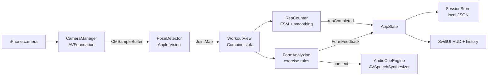

# Form

Offline-first, real-time gym form coaching for iPhone.

Form uses the device camera, Apple Vision body-pose detection, simple geometry rules, and spoken cues to help users correct exercise technique while they lift. The important privacy promise is simple: camera frames are processed on-device and are never uploaded.

## Quick Start

### Run the Logic Tests

```bash
DEVELOPER_DIR=/Applications/Xcode.app/Contents/Developer swift test
```

Use focused tests while iterating:

```bash
DEVELOPER_DIR=/Applications/Xcode.app/Contents/Developer swift test --filter RepCounterTests
DEVELOPER_DIR=/Applications/Xcode.app/Contents/Developer swift test --filter FormAnalyzerTests
```

### Run the iOS App

- Use a physical iPhone running iOS 17 or later for real pose detection.
- The simulator can open UI, but it cannot provide a useful camera feed.
- The `.xcodeproj` is intentionally ignored. Follow `XCODE_SETUP.md` to create a local Xcode project that points at the checked-in source files.

## Documentation Map

- `docs/DEVELOPING.md` — first-hour onboarding, commands, workflow, pitfalls.
- `docs/ARCHITECTURE.md` — system diagrams, runtime flow, threading, persistence, extension points.
- `XCODE_SETUP.md` — step-by-step local Xcode project setup.
- `DEMO.md` — proof-of-concept demo checklist.
- `ValidationPlan.md` — accuracy validation strategy and benchmark ideas.
- `Availability.md` — roadmap for improving joint detection and rule accuracy.
- `CLAUDE.md` — agent-specific guidance for AI coding assistants.

## Repository Layout

```text
Form/
├── Form/
│   ├── App/                 SwiftUI entry point and global app state
│   ├── Features/
│   │   ├── AudioCues/       On-device text-to-speech cue queue
│   │   ├── Camera/          AVFoundation capture session
│   │   ├── FormAnalysis/    Exercise analyzers and rule engine
│   │   ├── PoseDetection/   Apple Vision pose wrapper
│   │   └── RepTracking/     Rep-counting finite-state machine
│   ├── Models/              Session, rep, score, and voice-preference models
│   ├── Persistence/         JSON session storage + UserDefaults settings store
│   └── UI/                  SwiftUI screens and drawing components
│       ├── Settings/        Voice + exercise-selection preferences screen
│       └── Workout/         Live camera screen, HUD, exercise selection
├── FormTests/               Headless logic tests
├── ValidationSupport/       SwiftPM-only shims for testability
├── Package.swift            SwiftPM harness for pure logic tests
└── docs/                    New-developer documentation
```

## Architecture Snapshot



See `docs/ARCHITECTURE.md` for the full set of diagrams.

## Current Status

| Area | Status | Notes |
| --- | --- | --- |
| Camera pipeline | Done | Front camera, permission handling, live sample buffers. |
| Pose detection | Done | `VNDetectHumanBodyPoseRequest` produces normalized 2D joints. |
| Skeleton overlay | Done | SwiftUI `Canvas` draws joints and bones over the preview. |
| Rep counting | Done | Per-exercise thresholds, smoothing, and FSM transitions. |
| Persistence | Done | Sessions are stored as local JSON in the app sandbox. |
| Audio cues | Done | Deduplicated, rate-limited on-device speech with user-selectable voice, pitch, and rate. |
| Settings | Done | Voice preferences and exercise-selection style, persisted via `UserDefaults` (`SettingsStore`). |
| Exercise selection | Done | Two A/B-testable UIs: a dedicated selection screen and an inline picker over the camera. |
| Camera positioning | Done | Per-exercise framing guidance (`ExerciseType.cameraSetup`) shown before each set. |
| Squat rules | Partial | Knee cave and shallow depth heuristics exist. |
| Lat pulldown rules | Partial | ROM, shrug, grip asymmetry, and elbow flare heuristics exist. |
| Dumbbell bench rules | Partial | Asymmetry, ROM, wrist drift, and elbow tuck heuristics exist. |
| Deadlift and barbell bench rules | Stubbed | They count reps but currently return `.good` for form feedback. |

## Ground Rules

- No network calls for camera frames, joint maps, sessions, or coaching logic.
- Keep hardware-specific code thin; put decision logic in testable Swift types.
- Treat `JointMap` coordinates as normalized view coordinates with a top-left origin.
- Mutate SwiftUI-observed state on the main thread.
- Add or update logic tests when changing analyzers, scoring, rep counting, or persistence.
