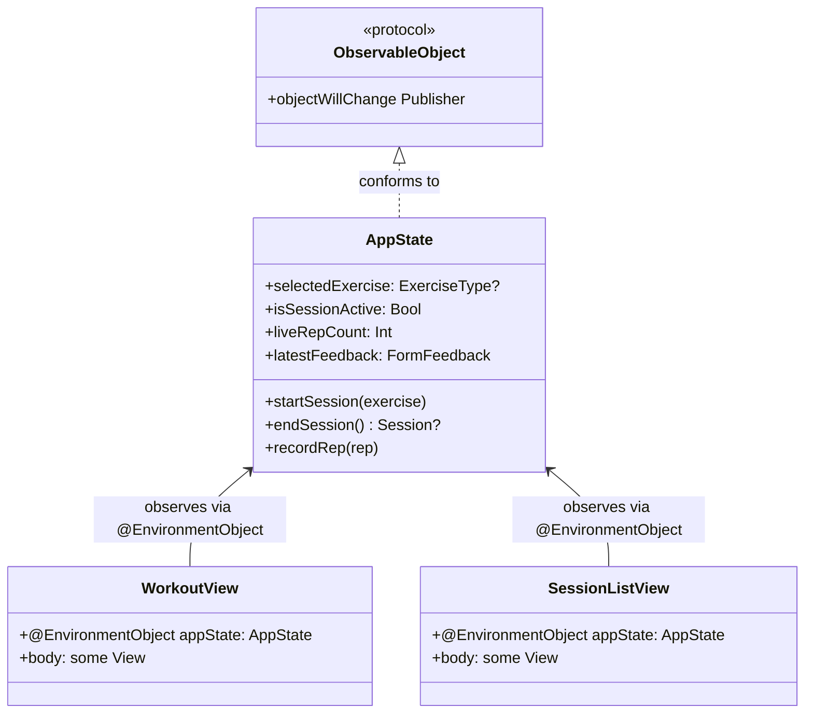
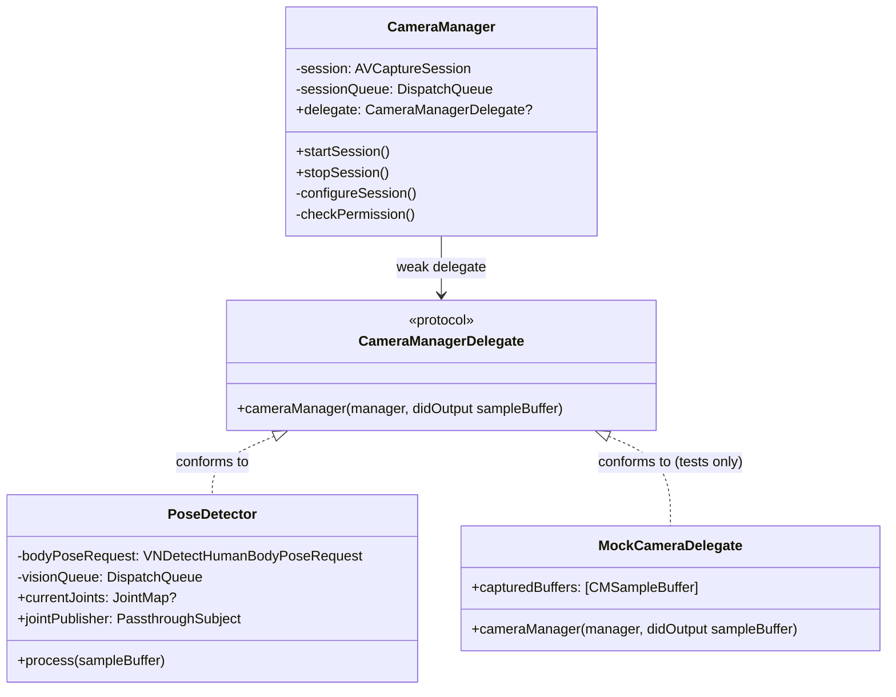
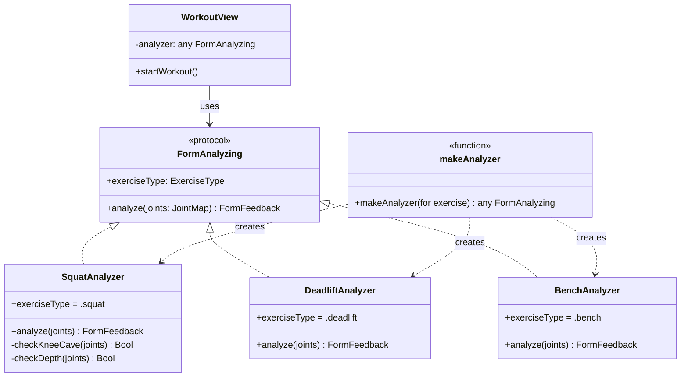
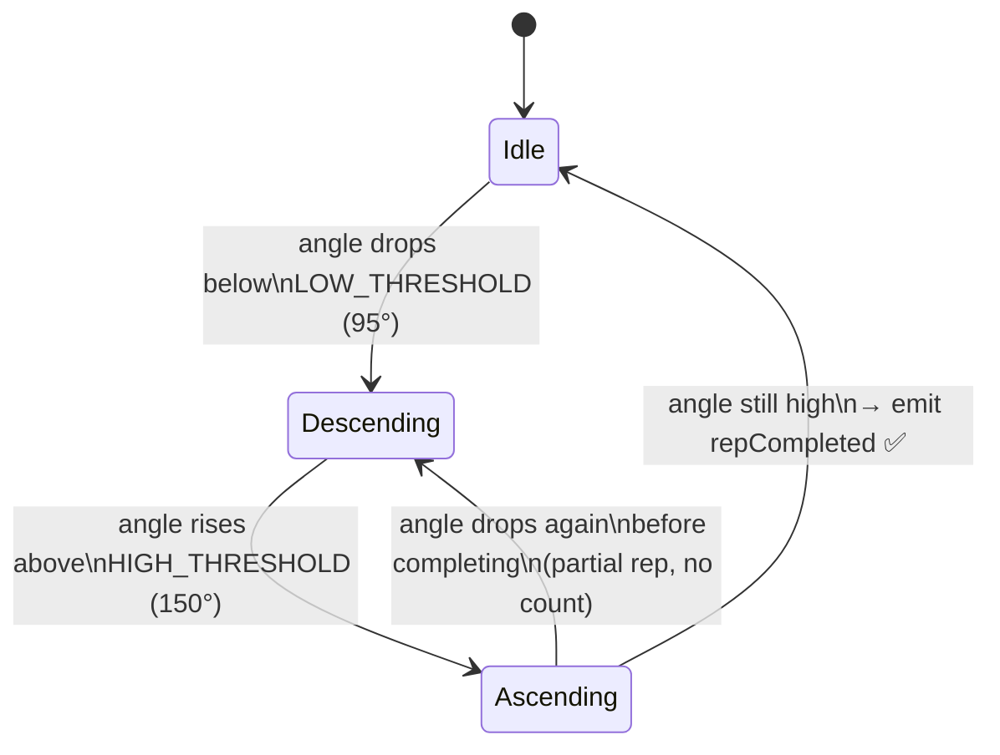
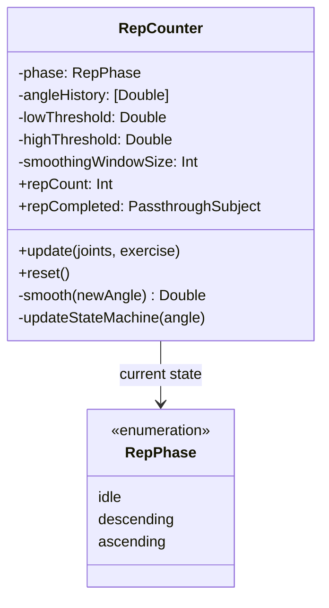
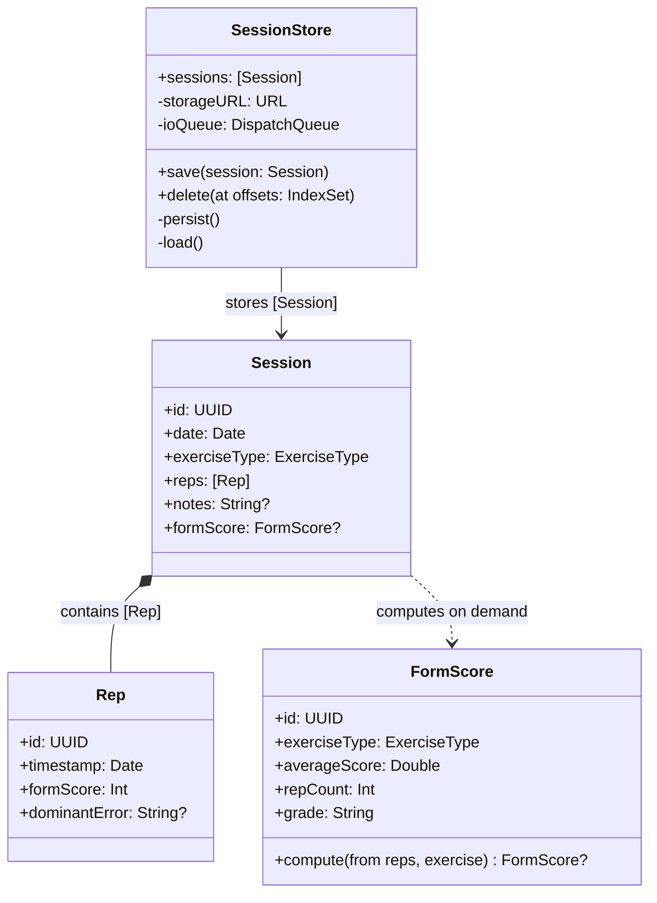
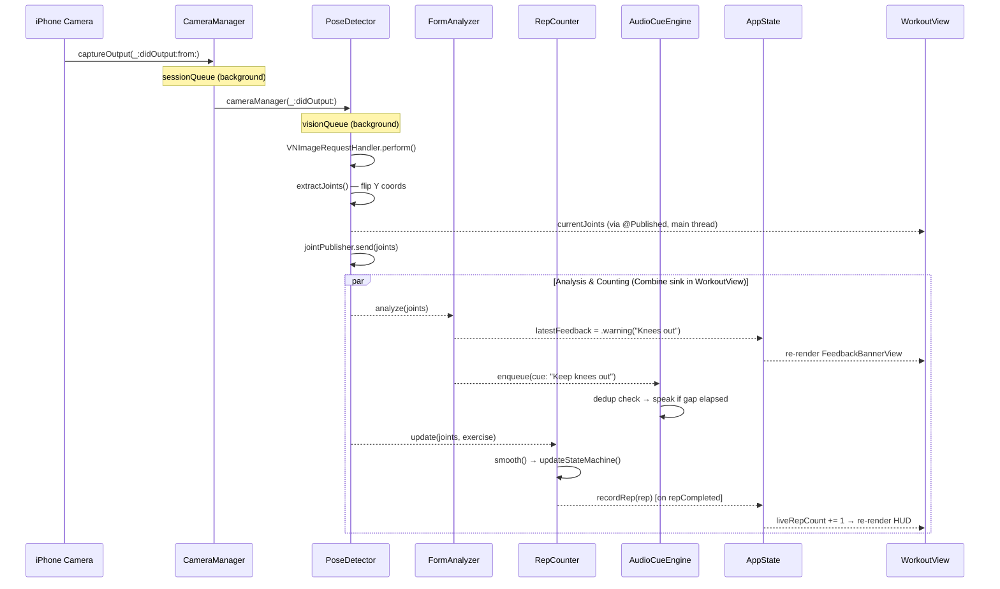
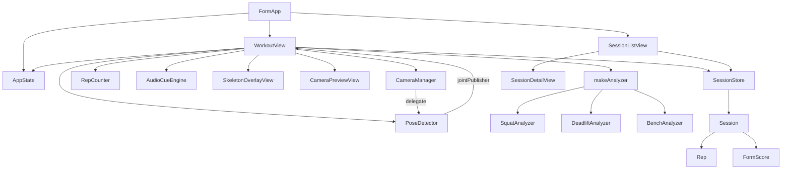

# Form

> **Offline-first, real-time gym form correction using Apple Vision and SwiftUI.**

Form analyzes your exercise technique using only your iPhone's camera. Every frame is processed on-device using Apple's Vision framework for body pose estimation, then passed through a rule-based engine that detects form faults and speaks coaching cues aloud — all without a single byte leaving your phone.

---

## Why Offline-First?

### Privacy
Video of yourself working out is among the most sensitive data a person can generate. With Form, that data never moves. No frames are uploaded, no joint coordinates are logged to a server, no user account is required. The camera feed exists only in RAM for the duration of each frame's processing cycle, then ARC releases it. Disable Wi-Fi and cellular — Form works identically.

### Latency
Sending a video frame to a cloud API and returning feedback takes 200–800ms under good network conditions. At the bottom of a squat with a loaded barbell, 800ms is too slow — you've already moved. On-device inference via Apple's Neural Engine runs in under 10ms. Real-time coaching requires real-time inference.

### Unit Economics
Cloud compute isn't free. A model processing 30fps × 60s × 100,000 users requires infrastructure that's unsustainable without a subscription. On-device inference costs the developer $0 per frame and scales with hardware sold by Apple.

---

## LLD: Design Patterns Used

This project is a good learning vehicle for Low-Level Design because it uses five distinct patterns. Each section below includes a UML diagram.

---

### 1. Observer Pattern — `@Published` / `ObservableObject`

**What it is:** An object (the *subject*) maintains a list of *observers* that are notified automatically when its state changes. In SwiftUI, this is built into the language via `ObservableObject` + `@Published`.

**Where it appears:** `AppState`, `CameraManager`, `PoseDetector`, `RepCounter`, `SessionStore` are all subjects. SwiftUI views are the observers — they re-render whenever a `@Published` property changes.



> **Key insight:** The views never *pull* state — they *react* to it. This is the reactive programming model. Equivalent to RxJava's `Observable` or React's `useState` + re-render cycle.

---

### 2. Delegate Pattern — `CameraManagerDelegate`

**What it is:** An object hands off responsibility for handling specific events to a *delegate* (another object it holds a weak reference to). The delegating object stays decoupled from what the delegate actually does.

**Where it appears:** `CameraManager` delivers raw `CMSampleBuffer` frames to whatever object is set as its `delegate`. In production that's `PoseDetector`. In tests, it can be a `MockDelegate`.



> **Key insight:** `CameraManager` knows nothing about Vision or pose detection. It just calls `delegate?.cameraManager(self, didOutput:)`. This is the *Dependency Inversion Principle*: depend on abstractions (the protocol), not concretions (PoseDetector directly).

---

### 3. Strategy Pattern — `FormAnalyzing` Protocol

**What it is:** Define a family of algorithms (strategies), encapsulate each one, and make them interchangeable. The client selects a strategy at runtime without changing its own code.

**Where it appears:** `FormAnalyzing` is the strategy protocol. `SquatAnalyzer`, `DeadliftAnalyzer`, `BenchAnalyzer` are concrete strategies. `WorkoutView` holds a reference typed as `any FormAnalyzing` — it calls `analyze()` without knowing which exercise it's analyzing.



> **Key insight:** Adding a new exercise (e.g., `OHPAnalyzer`) requires zero changes to `WorkoutView` — just create a new conforming struct and add a case to `makeAnalyzer()`. This is the *Open/Closed Principle*: open for extension, closed for modification.

---

### 4. State Machine Pattern — `RepCounter`

**What it is:** An object can exist in one of a finite set of *states*. Each state defines which *transitions* are valid and what *actions* they trigger. This is one of the most important patterns in systems that process time-series data.

**Where it appears:** `RepCounter` uses a 3-state FSM to detect when an angle time series completes a full rep cycle.





> **Key insight:** Without the FSM, you'd need a mess of boolean flags. The FSM makes the logic read like a description of the physical movement — each state name tells you exactly what the user is doing.

---

### 5. Repository Pattern — `SessionStore`

**What it is:** A *repository* abstracts the data layer behind a clean interface. Callers ask the repository to save/load objects and don't need to know whether the backing store is JSON, SQLite, or a network API.

**Where it appears:** `SessionStore` hides all JSON encoding, file path construction, and thread dispatch behind `save(session:)` and `sessions` (the published array).



---

## Full System Data Flow

This sequence diagram shows how a single camera frame travels through the entire pipeline from hardware to UI.



---

## Component Dependency Graph



---

## Unit Testing Guide

### Philosophy: What's Worth Testing?

Not everything needs a test. In this codebase, there's a clear split:

| Layer | Testable? | Why |
|-------|-----------|-----|
| `GeometryHelpers.angle()` | ✅ Yes | Pure function, deterministic |
| `FormScore.compute()` | ✅ Yes | Pure function |
| `RepCounter` state machine | ✅ Yes | No hardware, just math |
| `SquatAnalyzer.analyze()` | ✅ Yes | Takes a plain dictionary |
| `SessionStore` encode/decode | ✅ Yes | File I/O, easy to mock |
| `CameraManager` | ⚠️ Hard | Requires real hardware |
| `PoseDetector` | ⚠️ Hard | Requires Vision + camera frames |
| SwiftUI Views | ⚠️ Hard | Prefer UI/snapshot tests |

The rule of thumb: **if it's a pure function or a state machine, test it first**.

---

### Step 1: Add the Test Target in Xcode

1. In Xcode: **File → New → Target → Unit Testing Bundle**
2. Name it `FormTests`
3. Make sure **Target to be Tested** is set to `Form`
4. Xcode creates `FormTests/FormTests.swift` — delete its contents and start fresh

Your project navigator should now look like:
```
Form/          ← app source (what we built)
FormTests/     ← NEW: test files go here
```

---

### Step 2: Test `GeometryHelpers` — Pure Function Tests

These are the easiest tests to write. A right angle should always be 90°:

```swift
// FormTests/GeometryHelpersTests.swift
import XCTest
@testable import Form   // @testable lets tests access internal types

final class GeometryHelpersTests: XCTestCase {

    // MARK: - Right angle

    func testRightAngle() {
        // Arrange: three points forming a perfect L-shape
        //      A(0,1)
        //        |
        //        B(0,0) ──── C(1,0)
        let a = CGPoint(x: 0, y: 1)
        let b = CGPoint(x: 0, y: 0)  // vertex
        let c = CGPoint(x: 1, y: 0)

        // Act
        let angle = GeometryHelpers.angle(a: a, b: b, c: c)

        // Assert
        XCTAssertEqual(angle, 90.0, accuracy: 0.001)
    }

    // MARK: - Straight line (180°)

    func testStraightAngle() {
        let a = CGPoint(x: -1, y: 0)
        let b = CGPoint(x: 0,  y: 0)
        let c = CGPoint(x: 1,  y: 0)

        let angle = GeometryHelpers.angle(a: a, b: b, c: c)

        XCTAssertEqual(angle, 180.0, accuracy: 0.001)
    }

    // MARK: - Degenerate case (same points → should not crash)

    func testDegeneratePointsReturnZero() {
        let point = CGPoint(x: 0.5, y: 0.5)
        let angle = GeometryHelpers.angle(a: point, b: point, c: point)
        XCTAssertEqual(angle, 0.0)
    }
}
```

Run with **⌘U**. These should pass immediately with zero setup.

---

### Step 3: Test `RepCounter` — State Machine Tests

```swift
// FormTests/RepCounterTests.swift
import XCTest
import Combine
@testable import Form

final class RepCounterTests: XCTestCase {

    var counter: RepCounter!
    var cancellables: Set<AnyCancellable>!

    override func setUp() {
        // Use tight thresholds so we can trigger reps with simple test values
        counter = RepCounter(lowThreshold: 90, highThreshold: 140)
        cancellables = []
    }

    // Helper: build a JointMap with a specific hip angle
    // We place joints so that GeometryHelpers.angle() returns approx the target
    func makeSquatJoints(hipAngleDegrees: Double) -> JointMap {
        // Place leftHip at origin, leftShoulder above, leftKnee at angle
        let radians = hipAngleDegrees * .pi / 180.0
        return [
            .leftShoulder: CGPoint(x: 0, y: -1),   // directly above hip
            .leftHip:      CGPoint(x: 0, y: 0),     // origin
            .leftKnee:     CGPoint(x: sin(radians), y: cos(radians))
        ]
    }

    // MARK: - One complete rep

    func testOneCompleteRepIsDetected() {
        var repCount = 0
        counter.repCompleted
            .sink { repCount += 1 }
            .store(in: &cancellables)

        // Simulate: standing (160°) → bottom (70°) → standing (160°)
        // Feed enough frames for the moving average to settle
        for _ in 0..<6 { counter.update(joints: makeSquatJoints(hipAngleDegrees: 160), exercise: .squat) }
        for _ in 0..<6 { counter.update(joints: makeSquatJoints(hipAngleDegrees: 70),  exercise: .squat) }
        for _ in 0..<6 { counter.update(joints: makeSquatJoints(hipAngleDegrees: 160), exercise: .squat) }

        XCTAssertEqual(repCount, 1)
        XCTAssertEqual(counter.repCount, 1)
    }

    // MARK: - Incomplete rep (no count)

    func testPartialRepNotCounted() {
        var repCount = 0
        counter.repCompleted
            .sink { repCount += 1 }
            .store(in: &cancellables)

        // Go down but don't come back up
        for _ in 0..<6 { counter.update(joints: makeSquatJoints(hipAngleDegrees: 160), exercise: .squat) }
        for _ in 0..<6 { counter.update(joints: makeSquatJoints(hipAngleDegrees: 70),  exercise: .squat) }

        XCTAssertEqual(repCount, 0)
    }

    // MARK: - Reset clears count

    func testResetClearsState() {
        for _ in 0..<6 { counter.update(joints: makeSquatJoints(hipAngleDegrees: 160), exercise: .squat) }
        for _ in 0..<6 { counter.update(joints: makeSquatJoints(hipAngleDegrees: 70),  exercise: .squat) }
        for _ in 0..<6 { counter.update(joints: makeSquatJoints(hipAngleDegrees: 160), exercise: .squat) }

        counter.reset()

        XCTAssertEqual(counter.repCount, 0)
    }
}
```

---

### Step 4: Test `FormAnalyzer` — Strategy Pattern Tests

Because `SquatAnalyzer` is a struct with no dependencies, it's trivially testable:

```swift
// FormTests/FormAnalyzerTests.swift
import XCTest
@testable import Form

final class SquatAnalyzerTests: XCTestCase {

    let analyzer = SquatAnalyzer()

    // MARK: - Good form (symmetric joints, hips above knees)

    func testGoodFormReturnsGood() {
        let joints: JointMap = [
            .leftHip:   CGPoint(x: 0.4, y: 0.4),
            .rightHip:  CGPoint(x: 0.6, y: 0.4),
            .leftKnee:  CGPoint(x: 0.4, y: 0.6),
            .rightKnee: CGPoint(x: 0.6, y: 0.6)
        ]
        let feedback = analyzer.analyze(joints: joints)
        XCTAssertEqual(feedback, .good)
    }

    // MARK: - Knee cave triggers warning

    func testKneeCaveTriggersWarning() {
        // Left knee caved inward (x much smaller than left hip x)
        let joints: JointMap = [
            .leftHip:   CGPoint(x: 0.4, y: 0.4),
            .rightHip:  CGPoint(x: 0.6, y: 0.4),
            .leftKnee:  CGPoint(x: 0.25, y: 0.6),  // 0.25 < 0.4 - 0.05 → cave
            .rightKnee: CGPoint(x: 0.6,  y: 0.6)
        ]
        let feedback = analyzer.analyze(joints: joints)
        if case .warning = feedback { /* pass */ } else {
            XCTFail("Expected .warning for knee cave, got \(feedback)")
        }
    }

    // MARK: - Missing joints → should not crash

    func testMissingJointsReturnsGood() {
        let feedback = analyzer.analyze(joints: [:])
        XCTAssertEqual(feedback, .good)
    }
}
```

---

### Step 5: Test `SessionStore` — Repository Pattern / JSON Round-Trip

```swift
// FormTests/SessionStoreTests.swift
import XCTest
@testable import Form

final class SessionStoreTests: XCTestCase {

    // MARK: - JSON round-trip

    func testSessionEncodesAndDecodesSymmetrically() throws {
        // Arrange
        let rep = Rep(formScore: 85, dominantError: "Knees caved")
        let session = Session(
            id: UUID(),
            date: Date(),
            exerciseType: .squat,
            reps: [rep],
            notes: "Felt strong today"
        )

        // Act: encode → decode
        let encoder = JSONEncoder()
        encoder.dateEncodingStrategy = .iso8601
        let data = try encoder.encode(session)

        let decoder = JSONDecoder()
        decoder.dateDecodingStrategy = .iso8601
        let decoded = try decoder.decode(Session.self, from: data)

        // Assert
        XCTAssertEqual(decoded.id,                    session.id)
        XCTAssertEqual(decoded.exerciseType,           session.exerciseType)
        XCTAssertEqual(decoded.reps.count,             1)
        XCTAssertEqual(decoded.reps.first?.formScore,  85)
        XCTAssertEqual(decoded.reps.first?.dominantError, "Knees caved")
        XCTAssertEqual(decoded.notes,                  "Felt strong today")
    }

    // MARK: - FormScore.compute

    func testFormScoreAveragesCorrectly() {
        let reps = [
            Rep(formScore: 100),
            Rep(formScore: 80),
            Rep(formScore: 60)
        ]
        let score = FormScore.compute(from: reps, exercise: .squat)
        XCTAssertNotNil(score)
        XCTAssertEqual(score!.averageScore, 80.0, accuracy: 0.001)
        XCTAssertEqual(score!.repCount, 3)
    }

    func testFormScoreReturnsNilForEmptyReps() {
        let score = FormScore.compute(from: [], exercise: .squat)
        XCTAssertNil(score)
    }

    // MARK: - Grade boundaries

    func testGradeBoundaries() {
        func score(_ avg: Double) -> FormScore {
            FormScore(id: UUID(), exerciseType: .squat, averageScore: avg, repCount: 1, date: Date())
        }
        XCTAssertEqual(score(95).grade, "A")
        XCTAssertEqual(score(85).grade, "B")
        XCTAssertEqual(score(75).grade, "C")
        XCTAssertEqual(score(65).grade, "D")
        XCTAssertEqual(score(45).grade, "F")
    }
}
```

---

### Step 6: Using the Mock Delegate Pattern in Tests

This is the Delegate pattern working for you — because `CameraManagerDelegate` is a protocol, you can write a fake one for tests without touching any hardware:

```swift
// FormTests/PoseDetectorTests.swift
import XCTest
import AVFoundation
@testable import Form

// A mock that records every buffer it receives
final class MockCameraDelegate: CameraManagerDelegate {
    var receivedBuffers: [CMSampleBuffer] = []
    func cameraManager(_ manager: CameraManager, didOutput sampleBuffer: CMSampleBuffer) {
        receivedBuffers.append(sampleBuffer)
    }
}

final class CameraManagerDelegateTests: XCTestCase {

    func testDelegateReceivesBuffer() {
        let manager = CameraManager()
        let mock = MockCameraDelegate()
        manager.delegate = mock

        // We can't trigger a real camera frame in tests, but we CAN verify
        // that the delegate is wired correctly by checking it's set:
        XCTAssertTrue(manager.delegate === mock)
        // Real frame delivery is tested via UI/integration tests on device
    }
}
```

---

### Test Coverage Summary

| Test File | Pattern Exercised | Key Assertions |
|-----------|------------------|----------------|
| `GeometryHelpersTests` | Pure function | Right angle = 90°, straight = 180°, degenerate = 0° |
| `RepCounterTests` | State machine (FSM) | Full cycle = 1 rep, partial = 0, reset clears |
| `SquatAnalyzerTests` | Strategy pattern | Good joints → .good, caved knee → .warning |
| `SessionStoreTests` | Repository / JSON | Round-trip fidelity, grade boundaries, nil on empty |
| `CameraManagerDelegateTests` | Delegate pattern | Protocol wiring without hardware |

Run all tests with **⌘U** in Xcode.

---

## How to Open and Run

### Prerequisites
- macOS 14 Sonoma or later
- Xcode 15 or later
- iPhone running iOS 17+ (simulator works for UI; physical device needed for real pose detection)

### Steps

1. **Open in Xcode** — File → New → Project → App, then drag the `Form/` folder in
2. **Set Bundle ID and Team** — Signing & Capabilities → your Apple ID
3. **Run on Simulator** — ⌘R (camera simulated, no skeleton)
4. **Run on Device** — connect iPhone, select device, ⌘R, accept camera permission
5. **Run tests** — ⌘U (all tests in FormTests target)

---

## What's Implemented vs Stubbed

| Component | Status | Notes |
|-----------|--------|-------|
| `CameraManager` | ✅ Done | Full AVCaptureSession, front camera, permissions |
| `PoseDetector` | ✅ Done | Vision body pose, Y-flip, joint map publishing |
| `FormAnalyzing` protocol | ✅ Done | ExerciseType, FormFeedback, factory function |
| `SquatAnalyzer` | 🔶 Stub | Knee cave + depth; thresholds need calibration |
| `DeadliftAnalyzer` | 🔶 Stub | Always returns `.good` |
| `BenchAnalyzer` | 🔶 Stub | Always returns `.good` |
| `RepCounter` | ✅ Done | FSM + smoother; thresholds need calibration |
| `AudioCueEngine` | ✅ Done | Queued, deduplicated, rate-limited TTS |
| `SessionStore` | ✅ Done | JSON to Documents dir, atomic writes |
| `WorkoutView` | ✅ Done | Full pipeline wiring |
| `SkeletonOverlayView` | ✅ Done | Canvas skeleton with documented joint pairs |
| Unit Tests | 🔶 Stub | Examples above — add `FormTests` target to compile |

---

## Architecture Principles

- **No network calls. Ever.** If you're writing `URLSession`, stop.
- **Data flows down, events flow up.** Views are functions of state; they never mutate it directly.
- **One background queue per subsystem.** `sessionQueue`, `visionQueue`, `ioQueue`, `audioQueue`. Always `DispatchQueue.main.async` for UI updates.
- **Test the pure core.** Hardware-dependent code (camera, Vision) stays thin; logic lives in testable plain Swift types.

---

*Built with SwiftUI, AVFoundation, and Apple Vision. No third-party dependencies. No data ever leaves your device.*
