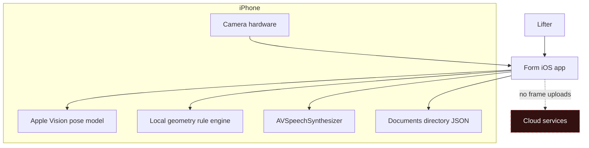
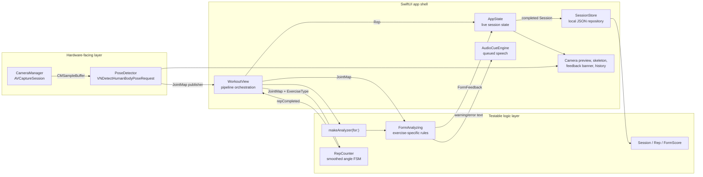
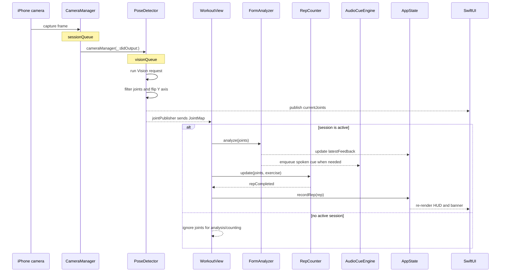
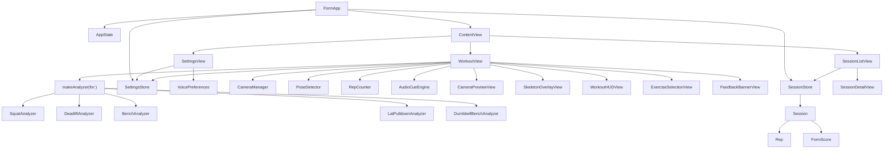
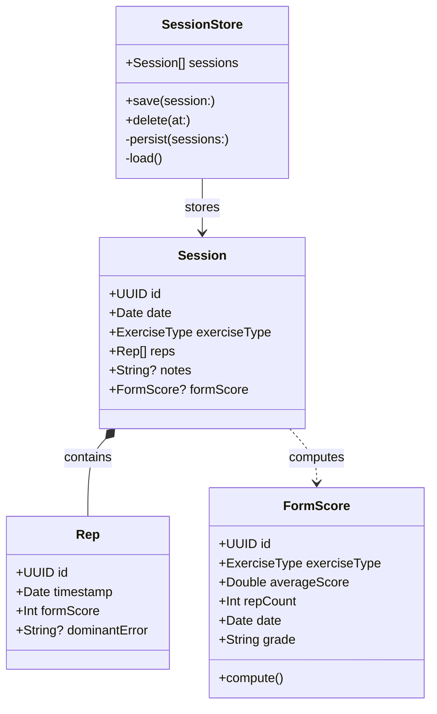
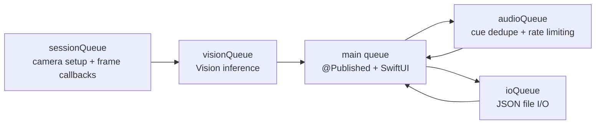
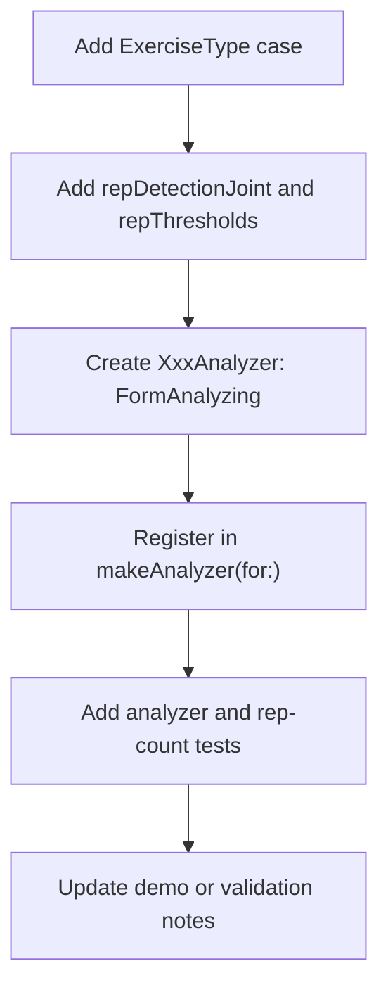

# Architecture

This document is the map for how Form works at runtime. If you are new to the codebase, read `README.md` first, then use this file while navigating the source.

## System Context



The app has one firm boundary: video frames and joint coordinates stay on the device. Any future feature that wants remote sync or accounts should keep the live analysis path offline.

## Runtime Pipeline



## Per-Frame Sequence



## Component Ownership



`WorkoutView` owns the live-session objects with `@StateObject`. `FormApp` owns shared app-level objects (`AppState`, `SessionStore`, `SettingsStore`) with `@StateObject` and injects them through the SwiftUI environment.

## User Preferences

```mermaid
flowchart LR
    SettingsView["SettingsView"] -->|edits| SettingsStore["SettingsStore<br/>@Published, UserDefaults-backed"]
    SettingsStore -->|VoicePreferences| WorkoutView["WorkoutView"]
    WorkoutView -->|apply(_:)| AudioCueEngine["AudioCueEngine"]
    SettingsStore -->|ExerciseSelectionStyle| WorkoutView
    WorkoutView --> Dedicated["ExerciseSelectionView<br/>(dedicated screen)"]
    WorkoutView --> Inline["inline HUD picker"]
```

`SettingsStore` persists two preferences to `UserDefaults` and writes through on every change (via `didSet`):

- **`VoicePreferences`** — a pure, `Codable` value type (`voiceIdentifier`, `pitch`, `rate`) that clamps to `AVSpeechUtterance`'s valid ranges on both init and decode. `WorkoutView` pushes it into `AudioCueEngine` via `apply(_:)` on appear and whenever it changes, so spoken cues pick up the user's chosen voice without restarting a session. The voice is referenced by identifier `String` (not an `AVSpeechSynthesisVoice`) so the model stays on the testable side of the hardware boundary.
- **`ExerciseSelectionStyle`** — an A/B toggle between a dedicated selection screen (`ExerciseSelectionView`, shown over the camera until an exercise is chosen) and an inline picker in the workout HUD. Both variants surface `ExerciseType.cameraSetup` as a positioning tip before the set starts.

The backing `UserDefaults` is injectable so the headless harness can assert persistence against an isolated suite (`SettingsTests`).

## Data Model



Sessions are stored as one local JSON file. The app does not currently persist raw video, joint traces, or audio.

## Threading Model



| Queue | Owner | Work |
| --- | --- | --- |
| `sessionQueue` | `CameraManager` | Configure and run `AVCaptureSession`; deliver sample buffers. |
| `visionQueue` | `PoseDetector` | Run body-pose detection one frame at a time. |
| Main queue | SwiftUI and Combine sinks | Mutate `@Published` state and update views. |
| `audioQueue` | `AudioCueEngine` | Deduplicate cues, rate-limit speech, advance the queue. |
| `ioQueue` | `SessionStore` | Read and write session JSON without blocking UI. |

## Extension Points

### Add a New Exercise



Most new exercises should not require changes to `WorkoutView` or `RepCounter`. If they do, pause and check whether the new logic belongs behind `ExerciseType`, `FormAnalyzing`, or a small helper type instead.

### Improve Form Rules

- Prefer pure geometry helpers and deterministic thresholds first.
- Keep analyzers fast because they run on every detected frame.
- Add temporal state only when a single-frame rule creates false positives.
- Update `ValidationPlan.md` when adding a cue that needs benchmark labels.

## Coordinate Conventions

- `PoseDetector` returns a `JointMap`: `[VNHumanBodyPoseObservation.JointName: CGPoint]`.
- Coordinates are normalized from `0...1`.
- The origin is top-left after `PoseDetector` flips Vision's bottom-left Y axis.
- Front-camera preview is mirrored, so left/right geometry can be surprising.
- Missing joints are normal; analyzers should return `.good` or a neutral result when required joints are absent.

## Testability Boundary

Hardware-facing files are intentionally thin:

- `Form/Form/Features/Camera/CameraManager.swift`
- `Form/Form/Features/PoseDetection/PoseDetector.swift`
- `Form/Form/Features/AudioCues/AudioCueEngine.swift`
- SwiftUI views in `Form/Form/UI/`

Pure logic is covered by the SwiftPM harness:

- `Form/Form/Features/FormAnalysis/FormAnalyzer.swift`
- `Form/Form/Features/RepTracking/RepCounter.swift`
- `Form/Form/App/AppState.swift`
- `Form/Form/Models/`
- `Form/Form/Persistence/`

`ValidationSupport/JointMap.swift` exists only so this pure logic can compile without pulling camera and SwiftUI code into the test target.
